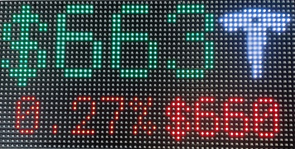

# TSLA Stock LED Display

This is derived from the Bitcoin Matrix, so setup is similar
* https://learn.adafruit.com/bitcoin-value-rgb-matrix-display/using-matrixportal
* https://github.com/adafruit/Adafruit_Learning_System_Guides/tree/master/Bitcoin_Matrix

General rule is _green_ if up and _red_ if down.

The top-left value is the price in regular market hours.

Bottom-right value is the price in pre/post trading.

Regular and pre/post values will be brighter if we're in those hours.

The bottom-left percent is the change since the regular market opened. If we're in pre-market trading, then it's the
pre-market percentage change.

